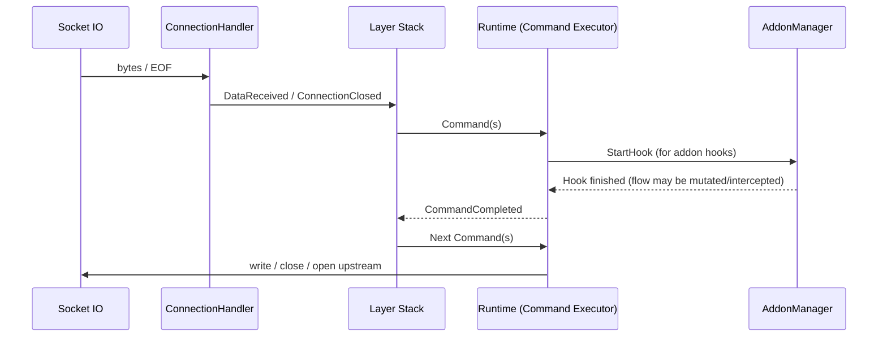

# Addons, Flows, Layers, and the Command-Event Loop (First Principles)

This document explains the core runtime model in mitmproxy from first principles and ties each concept to concrete source files.

## 1. Core Principle

At runtime, mitmproxy repeatedly executes this loop:

1. Socket IO is converted into typed events.
2. A protocol layer consumes events and yields commands.
3. The runtime executes commands (IO, hooks, timers, logging).
4. Command completion is emitted as new events.
5. Layers resume and continue.

Everything else (HTTP handling, TLS, addons, interception, replay) is built on top of this.

## 2. Events and Commands

### Events (input to layers)

Defined in `mitmproxy/proxy/events.py`:

- `Start`
- `DataReceived(connection, data)`
- `ConnectionClosed(connection)`
- `CommandCompleted(command, reply)` subclasses such as:
  - `OpenConnectionCompleted`
  - `HookCompleted`
  - `Wakeup`

These are the only way layers receive external state changes.

### Commands (output from layers)

Defined in `mitmproxy/proxy/commands.py`:

- `OpenConnection` (blocking)
- `SendData`
- `CloseConnection` / `CloseTcpConnection`
- `StartHook` (blocking)
- `RequestWakeup`
- `Log`

Layers do not perform socket operations directly. They emit commands and let runtime execute them.

## 3. Layers: Deterministic Protocol State Machines

Base class: `mitmproxy/proxy/layer.py`.

A layer:

- receives one event at a time (`handle_event`),
- runs state logic in `_handle_event`,
- yields commands,
- can pause on blocking commands and resume on matching `CommandCompleted`.

This gives blocking-style logic without blocking the event loop.

Key mechanism in `Layer.handle_event`:

- if a yielded command has `blocking=True`, the layer is paused,
- unrelated incoming events are buffered,
- when completion arrives, generator resumes with reply,
- buffered events replay afterward.

This is how mitmproxy keeps per-connection protocol logic clear and composable.

### Layer selection (`NextLayer`)

`mitmproxy/proxy/layer.py` defines `NextLayer`.
`mitmproxy/addons/next_layer.py` decides the concrete child layer based on:

- proxy mode (`regular`, `reverse`, `transparent`, `socks5`, `dns`, etc.),
- observed bytes (TLS/DTLS/QUIC/HTTP-like),
- ALPN/SNI,
- host-based options (`ignore_hosts`, `allow_hosts`, `tcp_hosts`, `udp_hosts`).

Mode-to-top-layer wiring is in `mitmproxy/proxy/mode_servers.py` (`RegularInstance`, `ReverseInstance`, `DnsInstance`, etc.).

## 4. Addons: Policy and Product Features

Addon manager: `mitmproxy/addonmanager.py`.
Hook model: `mitmproxy/hooks.py`.

### What addons are

- Python objects with hook-named methods (`request`, `response`, `tcp_message`, `dns_request`, ...).
- Registered in an ordered chain.
- Called for lifecycle and protocol events.

### Lifecycle

1. `load(loader)` during registration.
2. `configure(updated)` when options change.
3. `running` once startup completes.
4. protocol hooks during traffic.
5. `done` on shutdown.

### Hook dispatch path

1. Layer yields `StartHook` command.
2. Runtime schedules hook task (`proxy/server.py`).
3. `ProxyConnectionHandler.handle_hook` calls `master.addons.handle_lifecycle`.
4. AddonManager walks addon chain and calls matching methods.
5. Runtime emits `HookCompleted` if blocking.

For flow-carrying lifecycle events, `AddonManager.handle_lifecycle` also emits `UpdateHook`, so UI/state views refresh.

### Built-in addons

Default built-ins are listed in `mitmproxy/addons/__init__.py` (for example `proxyserver`, `next_layer`, `tlsconfig`, `dns_resolver`, `modifyheaders`, `save`).

## 5. Flows: Shared Mutable Domain State

Base flow: `mitmproxy/flow.py`.

A flow is the shared transaction/session object between:

- protocol core (layers),
- addons (policy),
- UI and persistence.

Common flow capabilities:

- `id`, connection references, timestamps, metadata
- error state (`flow.Error`)
- backup/revert support
- interception (`intercept`, `wait_for_resume`, `resume`)
- kill semantics (`kill`)

Concrete flow types:

- `HTTPFlow` in `mitmproxy/http.py`
- `TCPFlow` in `mitmproxy/tcp.py`
- `UDPFlow` in `mitmproxy/udp.py`
- `DNSFlow` in `mitmproxy/dns.py`

### Important behavior

- `flow.live` indicates active runtime ownership.
- Interception is a flow flag, not a separate transport mode.
- Addons can mutate flow fields before forwarding occurs.

## 6. Runtime Command/Event Loop (Execution Engine)

Main executor: `ConnectionHandler` in `mitmproxy/proxy/server.py`.

Core sequence:

1. `handle_connection` reads from socket/stream.
2. Emits `DataReceived` / `ConnectionClosed` into `server_event`.
3. `server_event` calls `layer.handle_event(event)`.
4. For each yielded command:
   - open connection task (`OpenConnection`)
   - write bytes (`SendData`)
   - close connection (`CloseConnection`)
   - run hook task (`StartHook`)
   - schedule timer (`RequestWakeup`)
5. Command completion re-enters layer as `CommandCompleted`.

The lock in `server_event` protects against reentrancy issues while dispatching command results.

## 7. End-to-End HTTP Example

For one HTTP request in the HTTP layer (`mitmproxy/proxy/layers/http/__init__.py`):

1. Parse request headers.
2. Yield `HttpRequestHeadersHook(flow)`.
3. Addons inspect/mutate/possibly intercept.
4. If intercepted, runtime waits for `flow.resume()`.
5. Layer continues, receives body, yields `HttpRequestHook(flow)`.
6. Opens upstream if needed (`OpenConnection`).
7. Sends request bytes to server (`SendData` via HTTP subcommands).
8. Receives response, yields `HttpResponseHeadersHook(flow)` then `HttpResponseHook(flow)`.
9. Emits response bytes to client.
10. Marks flow complete (`flow.live = False`) unless upgraded (for example WebSocket).

## 8. Mental Model for Architecture Work

When changing behavior, use this order:

1. **Flow model**: what state should exist?
2. **Hook contract**: what should addons see and when?
3. **Layer state machine**: where should decisions happen?
4. **Command execution**: what side effect is required?
5. **Event completion**: what reply is needed to resume state?

If this sequence is clear, most mitmproxy changes become predictable and safe.

