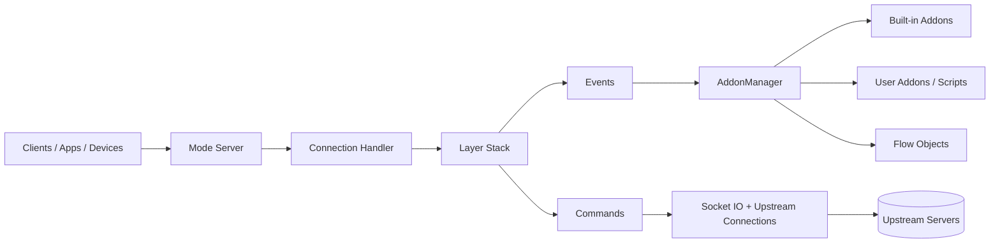
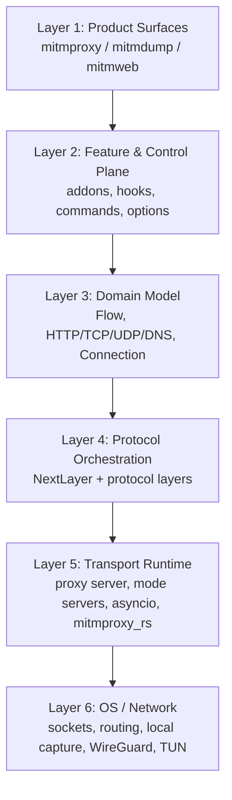
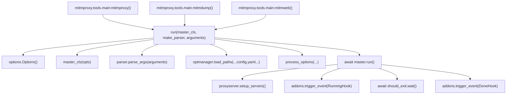
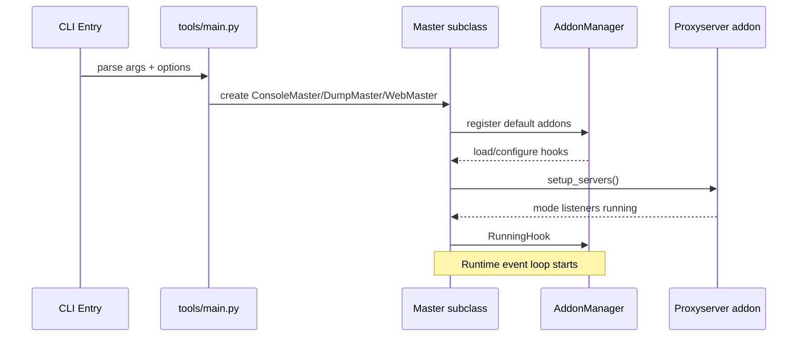
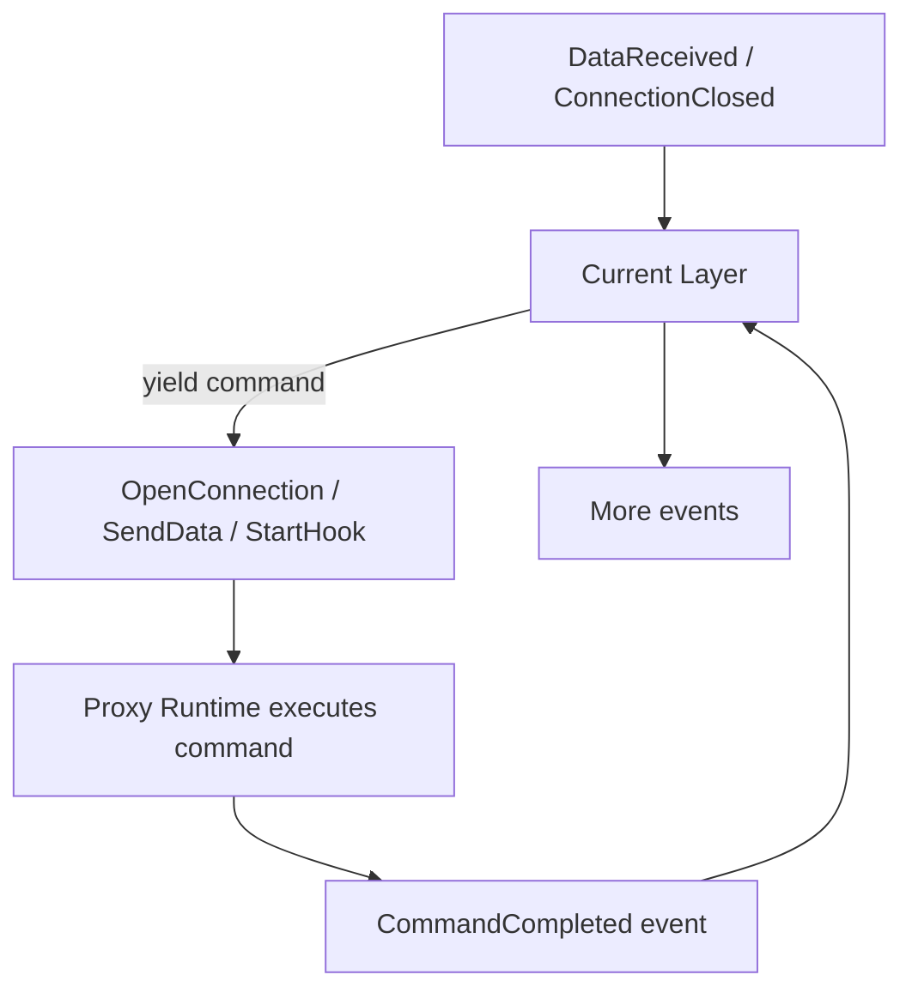
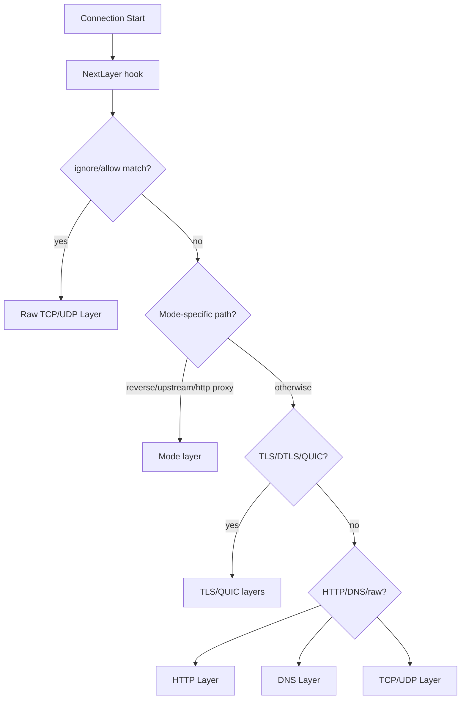
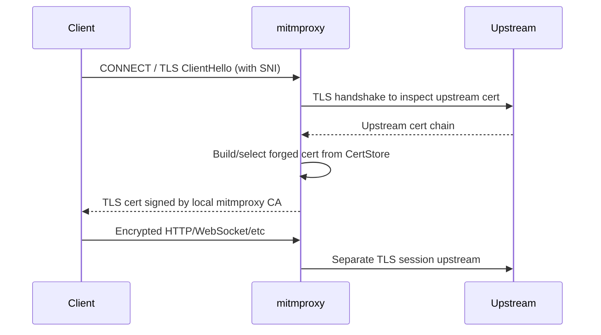
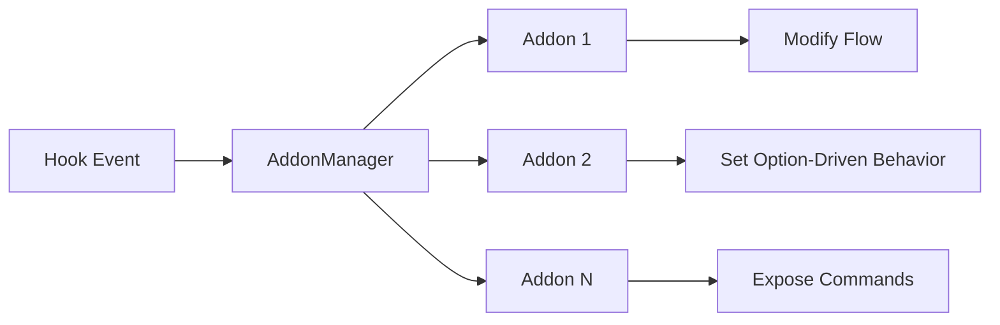
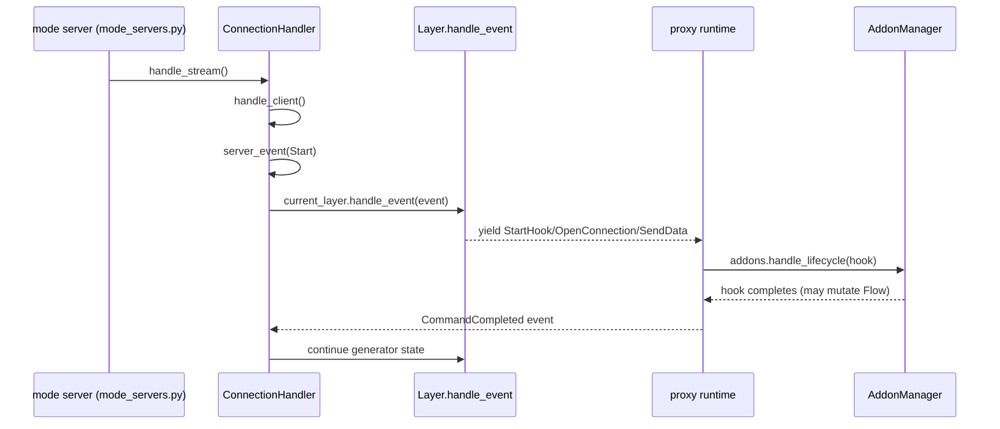

# mitmproxy Architecture Wiki

This document explains mitmproxy from first principles and maps important features to concrete code areas.

## 1. Core Idea

mitmproxy is a programmable man-in-the-middle proxy.

At runtime it does three things repeatedly:

1. Accept client traffic in one of several proxy modes.
2. Decode protocol streams into structured flow objects (`HTTPFlow`, `TCPFlow`, `DNSFlow`, ...).
3. Run addon hooks that can inspect, modify, block, replay, save, or synthesize traffic.

If you keep this model in mind, most of the codebase becomes predictable.

## 2. High-Level Architecture

### Principle

- **Layers** handle protocol mechanics.
- **Addons** handle product features.
- **Flows** are shared state between protocol core and feature logic.

### 2.1 Layered Architecture (Conceptual Stack)

Layer ownership in code:

- **Layer 1**: `mitmproxy/tools/console`, `mitmproxy/tools/dump.py`, `mitmproxy/tools/web`
- **Layer 2**: `mitmproxy/addons/*`, `mitmproxy/addonmanager.py`, `mitmproxy/command.py`
- **Layer 3**: `mitmproxy/flow.py`, `mitmproxy/http.py`, `mitmproxy/tcp.py`, `mitmproxy/udp.py`, `mitmproxy/dns.py`, `mitmproxy/connection.py`
- **Layer 4**: `mitmproxy/addons/next_layer.py`, `mitmproxy/proxy/layers/*`, `mitmproxy/proxy/layer.py`
- **Layer 5**: `mitmproxy/proxy/server.py`, `mitmproxy/proxy/mode_servers.py`, `mitmproxy/addons/proxyserver.py`
- **Layer 6**: `mitmproxy/platform/*`, `mitmproxy_rs` integrations for local, WireGuard, and TUN

## 3. Runtime Entrypoints

Defined in `pyproject.toml`:

- `mitmproxy` -> interactive TUI (`mitmproxy/tools/console`)
- `mitmdump` -> CLI/non-interactive (`mitmproxy/tools/dump.py`)
- `mitmweb` -> web UI + API server (`mitmproxy/tools/web`)

All three go through `mitmproxy/tools/main.py` and then instantiate a `Master` subclass.

### 3.1 Entrypoint Call Chains (Function-Level)

### 3.2 Tool-Specific Master Composition

- `DumpMaster.__init__` adds default addons + `Dumper`, `KeepServing`, `ReadFileStdin`, `ErrorCheck`.
- `ConsoleMaster.__init__` adds default addons + `Intercept`, `View`, `EventStore`, console-specific addons, `ErrorCheck`.
- `WebMaster.__init__` adds default addons + web auth/API/view/event addons + Tornado app integration.

## 4. Boot Sequence

## 5. Core Runtime Model: Events and Commands

This is the most important internal design.

- Inbound IO becomes **events** (`mitmproxy/proxy/events.py`), e.g. `DataReceived`.
- Layers process events and yield **commands** (`mitmproxy/proxy/commands.py`), e.g. `OpenConnection`, `SendData`, `StartHook`.
- The server runtime executes commands, generates completion events, and feeds them back.

`mitmproxy/proxy/layer.py` implements this as a generator-based state machine with support for pausing on blocking commands.

## 6. Layer Selection (`NextLayer`)

When a connection starts, mitmproxy does not always know the protocol stack yet.
`mitmproxy/addons/next_layer.py` decides dynamically.

Decision signals include:

- proxy mode (`regular`, `reverse`, `socks5`, `wireguard`, ...)
- first bytes on wire (TLS/DTLS/QUIC/HTTP-like)
- ALPN/SNI
- options (`tcp_hosts`, `udp_hosts`, `ignore_hosts`, `allow_hosts`, `rawtcp`)

## 7. Proxy Modes to Top Layers

Parsed in `mitmproxy/proxy/mode_specs.py`, instantiated in `mitmproxy/proxy/mode_servers.py`.

| Mode | Server Instance | Top Layer |
|---|---|---|
| `regular` | `RegularInstance` | `layers.modes.HttpProxy` |
| `upstream:...` | `UpstreamInstance` | `layers.modes.HttpUpstreamProxy` |
| `reverse:...` | `ReverseInstance` | `layers.modes.ReverseProxy` |
| `transparent` | `TransparentInstance` | `layers.modes.TransparentProxy` |
| `socks5` | `Socks5Instance` | `layers.modes.Socks5Proxy` |
| `dns` | `DnsInstance` | `layers.DNSLayer` |
| `wireguard` | `WireGuardServerInstance` | `layers.modes.TransparentProxy` |
| `local` | `LocalRedirectorInstance` | `layers.modes.TransparentProxy` |
| `tun` | `TunInstance` | `layers.modes.TransparentProxy` |

## 8. TLS MITM Model

Key pieces:

- Cert generation/store: `mitmproxy/certs.py`
- TLS policy and handshake contexts: `mitmproxy/addons/tlsconfig.py`
- User-facing behavior/docs: `docs/src/content/concepts/certificates.md`

Mitmproxy creates a local CA (first run), then issues per-host interception certs on demand.

## 9. Flow Model (Shared State)

Base: `mitmproxy/flow.py`

- `Flow`: connection-level metadata, lifecycle flags, interception state.
- `HTTPFlow` (`mitmproxy/http.py`): request/response (+ optional `websocket`).
- `TCPFlow`, `UDPFlow`, `DNSFlow`: protocol-specific representations.

Why this matters:

- Addons mostly operate on flow objects.
- UI, save/load, replay, export all consume the same flow model.

## 10. Addon System (Feature Layer)

Core files:

- `mitmproxy/addonmanager.py`
- `mitmproxy/hooks.py`
- `mitmproxy/command.py`
- Built-in registry: `mitmproxy/addons/__init__.py`

Addons can:

- define options (`loader.add_option`)
- react to hooks (`request`, `response`, `websocket_message`, ...)
- expose commands (`@command.command`)

## 11. Built-in Feature Map (Important)

Most user-facing features are plain addons:

| Feature | Main Code |
|---|---|
| Anti-cache | `mitmproxy/addons/anticache.py` |
| Blocklist | `mitmproxy/addons/blocklist.py` |
| Map local files | `mitmproxy/addons/maplocal.py` |
| Map remote URLs | `mitmproxy/addons/mapremote.py` |
| Modify body | `mitmproxy/addons/modifybody.py` |
| Modify headers | `mitmproxy/addons/modifyheaders.py` |
| Proxy auth (basic/htpasswd/ldap) | `mitmproxy/addons/proxyauth.py` |
| Sticky cookies/auth | `mitmproxy/addons/stickycookie.py`, `mitmproxy/addons/stickyauth.py` |
| Client replay | `mitmproxy/addons/clientplayback.py` |
| Server replay | `mitmproxy/addons/serverplayback.py` |
| Interception filter | `mitmproxy/addons/intercept.py` |
| Save flows | `mitmproxy/addons/save.py`, `mitmproxy/io/io.py` |
| Export/HAR | `mitmproxy/addons/export.py`, `mitmproxy/addons/savehar.py` |
| TLS behavior | `mitmproxy/addons/tlsconfig.py` |
| Proxy listener lifecycle | `mitmproxy/addons/proxyserver.py` |

## 12. UI Surfaces

- **Console UI**: `mitmproxy/tools/console/*` + `ConsoleMaster`
- **Web UI/API**: `mitmproxy/tools/web/*` + frontend in `web/src/*`
- **CLI dump**: `mitmproxy/tools/dump.py` + `mitmproxy/addons/dumper.py`

All are different shells around the same core (`Master`, addon chain, proxy runtime, flow model).

## 13. Persistence, Replay, and Offline Workflows

- Flow serialization: `mitmproxy/io/io.py` (tnetstring-based dump + HAR import path).
- Read on startup: `mitmproxy/addons/readfile.py`.
- Stream/write during runtime: `mitmproxy/addons/save.py`.
- Replay:
  - client-side: `mitmproxy/addons/clientplayback.py`
  - server-side: `mitmproxy/addons/serverplayback.py`

This reuse of one flow model is why replay and UI editing are consistent.

## 14. Important Directories Cheat Sheet

| Path | Purpose |
|---|---|
| `mitmproxy/tools/` | App entrypoints and UI-specific masters |
| `mitmproxy/proxy/` | Core networking runtime, layers, mode servers |
| `mitmproxy/addons/` | Product features (mostly here) |
| `mitmproxy/http.py`, `tcp.py`, `udp.py`, `dns.py` | Protocol flow/object models |
| `mitmproxy/certs.py` | CA and certificate generation/store |
| `mitmproxy/io/` | Flow read/write and compatibility |
| `web/src/` | mitmweb frontend |
| `docs/src/content/` | User and concept documentation |

## 15. Core Modules and Key Functions

This section is intentionally symbol-level so you can jump directly into code.

| Module | Key Types/Functions | Why It Matters |
|---|---|---|
| `mitmproxy/tools/main.py` | `run`, `process_options`, `mitmproxy`, `mitmdump`, `mitmweb` | Top-level startup, option loading, and signal wiring |
| `mitmproxy/master.py` | `Master.run`, `Master.running`, `Master.done`, `Master.load_flow`, `Master.shutdown` | Main lifecycle orchestration |
| `mitmproxy/addonmanager.py` | `AddonManager.register`, `AddonManager.add`, `AddonManager.trigger_event`, `AddonManager.handle_lifecycle` | Hook dispatch and addon integration |
| `mitmproxy/command.py` | `CommandManager.collect_commands`, `CommandManager.execute`, `CommandManager.call_strings` | Command parsing and invocation |
| `mitmproxy/proxy/server.py` | `ConnectionHandler.handle_client`, `ConnectionHandler.server_event`, `ConnectionHandler.open_connection`, `ConnectionHandler.handle_connection` | Async transport runtime |
| `mitmproxy/proxy/layer.py` | `Layer.handle_event`, `Layer._handle_event`, `NextLayer._ask` | Generator-based protocol state machine |
| `mitmproxy/addons/next_layer.py` | `next_layer`, `_next_layer`, `_setup_reverse_proxy` | Dynamic protocol/layer selection |
| `mitmproxy/proxy/mode_specs.py` | `ProxyMode.parse` + mode subclasses | Mode spec parsing and validation |
| `mitmproxy/proxy/mode_servers.py` | `ServerInstance.make`, `AsyncioServerInstance.listen`, `make_top_layer` | Turns mode specs into live listeners |
| `mitmproxy/addons/proxyserver.py` | `configure`, `setup_servers`, `inject_websocket`, `inject_tcp`, `inject_udp` | Listener lifecycle + runtime injection |
| `mitmproxy/addons/tlsconfig.py` | `tls_clienthello`, `tls_start_client`, `tls_start_server`, `get_cert` | TLS policy and MITM certificate selection |
| `mitmproxy/certs.py` | `CertStore.from_store`, `CertStore.create_store`, `CertStore.get_cert`, `dummy_cert` | CA bootstrap and cert generation/cache |
| `mitmproxy/flow.py` + protocol modules | `Flow` / `HTTPFlow` / `TCPFlow` / `UDPFlow` / `DNSFlow` | Shared traffic data model |
| `mitmproxy/io/io.py` | `FlowReader.stream`, `FlowWriter.add`, `read_flows_from_paths` | Persistence and replay input path |

### 15.1 Request Path With Function Landmarks

## 16. “Where Do I Change X?” Guide

- Add a **new feature**: usually create/modify an addon in `mitmproxy/addons/`.
- Add a **new proxy mode**: touch `mode_specs.py`, `mode_servers.py`, and likely `layers/modes.py`.
- Change **protocol parsing/forwarding**: `mitmproxy/proxy/layers/*`.
- Change **TLS interception behavior**: `mitmproxy/addons/tlsconfig.py` and `mitmproxy/certs.py`.
- Change **command surface**: add `@command.command` in an addon.
- Change **CLI flags exposed by tool**: `mitmproxy/tools/cmdline.py`.
- Change **web API payloads**: `mitmproxy/tools/web/app.py` + matching `web/src`.

## 17. Suggested Reading Order for New Contributors

1. `mitmproxy/tools/main.py`
2. `mitmproxy/master.py`
3. `mitmproxy/addons/__init__.py`
4. `mitmproxy/addonmanager.py`
5. `mitmproxy/proxy/server.py`
6. `mitmproxy/proxy/layer.py`
7. `mitmproxy/addons/next_layer.py`
8. `mitmproxy/proxy/layers/http/*`
9. `mitmproxy/addons/*` for the feature you care about

## 18. Rust Module Contract

For the Rust extension (`mitmproxy_rs`) API surface and lifecycle/semantics contract used by this codebase, see:

- `docs/MITMPROXY_RS_API.md`
